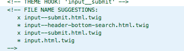

# Input Suggestions: Originating Block ID

The following snippet allows custom theming of input \(submit\) buttons that are contained in a block. A good example of when to use this snippet is when you have a search page exposed form and you want to theme the submit button for that form but only in the blocks context.

```php
function THEME_NAME_HERE_preprocess_block(&$vars) {
    // Check to see if block has ID
    if (isset($vars['elements']['#id'])) {
        
        // this block contains a form
        if ($block_id == "BLOCK_ID") {
            // we set a variable to access the block ID in the input template suggestion
            $vars['content']['actions']['submit']['#block-id'] = $block_id;
        }
    }
}

function THEME_NAME_HERE_theme_suggestions_input_alter(array &$suggestions, array $vars) {
    //check to see if block-id variable is set
    if (isset($vars['element']['#block-id'])) {
        $suggestions[] = 'input__' . $vars['element']['#block-id'];
    }
}
```



